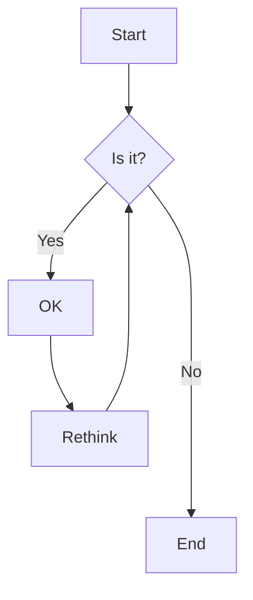

## Misc
- [x] CrateDB persistent (Splitted stop and delete case for services script)
- [x] Improve Grafana dashboard (https://github.blog/2022-05-19-math-support-in-markdown/)
- [x] Update Grafana to 9.1.3 (latest)
- [x] Update IoT-Agent to 2.0.5 (latest)
- [x] Update to Orion 3.7.0000 (latest stable)
- [x] Update to Mongo 4.4.18
- [x] Update to Crate 5.1.3 (latest)
- [x] Update to Redis 7.0.8 (latest)
- [x] Services port inherit from .env file
- [x] Add waitForQuantumleap
- [x] Switch Base image of the OEE-Service to python:3.9.16-alpine3.17 (from 892.95MB to 59.35MB)
- [ ] Make the PLC IP configurable in the same file as the .config of the ROSE-AP
- [ ] set .env in provision-device import-data
- [ ] set .env clenaup in services
- [ ] riscrivere lo script python
- [ ] mettere tutte le variabili dell .env nel docker-compsoe
- [ ] si possono rimuovere i WaitForCotiners visto che adesso startano in ordine?
## ROSE-AP
- [x] Removed the absurd necessity to re-build in case of .config update, (update .config > restart the container)
- [ ] Pushing the img to docker hub
- [ ] L'oee va calcolato on deamand ad ogni prodotto completato, per poi visualizzare a piacimento i dati potendo filtrare per prodotto, lotto, ora/giorno/mese/anno (websocket?)
- [ ] Bisogna scambiare i dati di prodotto, lotto e turno di produzione
- [ ] Ciclo tempo non prevede l'evenienza che non entri nel ciclo la prima volta
- [ ] Division by 0
- [ ] Ciclo tempo assurdo
- [ ] Division by 0
- [ ] Non gestite le eccezzioni di connessione
- [ ] Non gestite le eccezzioni di inserimento con key duplicata

## Phase 3
- [x] Github repository
- [ ] Step by Step Tutorial (nuova build, specificare l'origine dei dati, procesStatus, e lo switch di eventual icomponenti spedcificando l'architettura)
- [ ] NGSI-V2 Naming standard for procesStatus
- [ ] ID and atribute following Smart Factory Demo (https://github.com/FcoMelendez/smart_factory_demo)
### ROSE-AP
- [ ] Add information on machine activation status (e.g. records and calculate OEE only when it's active).
	- Provision the information about hte schedule production to know when in planned production on the microservice. (https://www.machinemetrics.com/blog/oee-ooe-teep)
- [ ] Add information about reworks (parts and time).
- [ ] Add information about total OEE stats for all the production.
- [ ] Extend to Factory level (e.g. un elemento nel contex broker che comunica lo scheduling dei turni di lavoro)

## RAMP in remoto
- Connessione remota RAMP

## Business
- Intregrare presso 2 clienti o lettera di intenti.
- Fee annuale per integrazione sulle macchine.

## Architettura

## Mermaid

