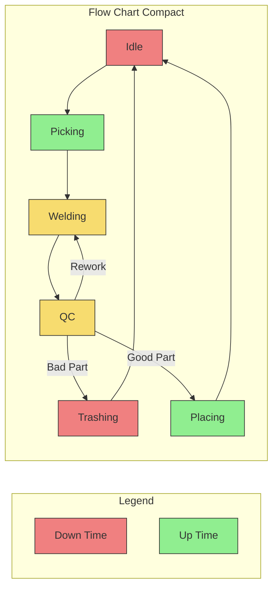

```mermaid
flowchart LR
    subgraph Legend
    downTime[Down Time]
    upTime[Up Time]
    end
    
    subgraph Flow Chart Compact
    Idle --> Picking --> Welding --> QC
    QC -- Rework --> Welding
    QC -- Bad Part --> Trashing --> Idle
    QC -- Good Part --> Placing --> Idle
    end


classDef upTime fill:lightgreen,stroke:#333,color:#333
classDef downTime fill:LightCoral,stroke:#333,color:#333
classDef upDownTime fill:#f7dc6f,stroke:#333,color:#333

class Picking,Placing,upTime upTime
class Idle,Trashing,Rework,downTime downTime
class QC,Welding upDownTime
```
