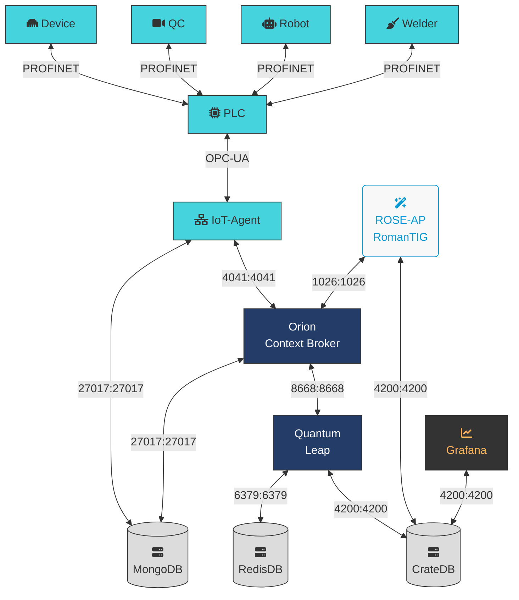
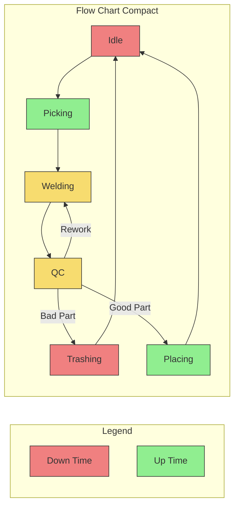

```mermaid
graph TD
    A[Christmas] -->|Get money| B(Go shopping)
    B --> C{Let me think}
    C -->|One| D[Laptop]
    C -->|Two| E[iPhone]
    C -->|Three| F[fa:fa-car Car]
	<i class="fa-duotone fa:fa-ethernet"></i>
```



classDef upTime fill:lightgreen,stroke:#333,color:#333
classDef downTime fill:LightCoral,stroke:#333,color:#333
classDef upDownTime fill:#f7dc6f,stroke:#333,color:#333

class Picking,Placing,upTime upTime
class Idle,Trashing,Rework,downTime downTime
class QC,Welding upDownTime
```

