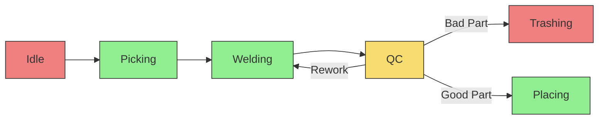

# ROMANTIG ROSE-AP OEE Calculator


This ROSE-AP is intended as a microservice for automatic OEE, and related metrics, calculation. The service works by connecting to a [Crate database](https://crate.io/) on port 4200, where information about the status of your target process are stored by [Orion](https://fiware-orion.readthedocs.io/en/master/) and [QuantumLeap](https://quantumleap.readthedocs.io/en/latest/) services.

## Table of Contents

- [Background](#background)
- [Install](#install)
- [Usage](#usage)
- [Example](#example)
- [Troubleshooting](#troubleshooting)

## Background
OEE (Overall Equipment Effectiveness) is a metric used in industrial applications to measure the effectiveness and efficiency of a manufacturing process. It is calculated by multiplying the three factors of Availability, Performance, and Quality.

Availability refers to the percentage of time a machine is available to run, taking into account scheduled and unscheduled downtime. Performance measures the actual output of the machine versus its maximum potential output. Quality assesses the percentage of good product produced versus the total number of products produced.

Measuring OEE is important in industrial applications as it provides a comprehensive view of the efficiency of the manufacturing process. By understanding the factors that contribute to inefficiencies, organizations can identify areas for improvement, increase production, and reduce costs. Additionally, OEE is a key indicator of the overall competitiveness of a company, as it is directly tied to production output and profitability.

## Install

In order to compute the OEE, the service must know if each possible process state that is found on CrateDB has to be considered an up-time or a down-time state. To do so, please change the `oee_conf.config` file found in the `oee_service` folder, prior to building the image of the service. You have to set the following variables:

```
[PROCESS]
upTimeStates = ["upTimeStateName1","upTimeStateName2",...,"upTimeStateNameN"] #These represents the states to be considered as up-time
downTimeStates = ["downTimeStateName1","downTimeStateName2",...,"downTimeStateNameN"]#These represents the states to be considered as down-time
endStates =["upTimeStateNameN","downTimeStateNameN",...] #Subset of either upTimeStates, downTimeStates or both. These represents the possibly multiple final states of the process
goodEnd =["endStatesName1",...] #Subset of endStates, these represents the final states in which an item is successfully created
badEnd =["endStatesName2",...] #Subset of endStates, these represents the final states in which an item is defective or faulty and has to be discarded

[OEE]
timestep = 300 #The timestep granularity (integer) for the resulting OEE metrics, in seconds
idealTime_ppm = 5 #The theoretical maximum piece per minute rate (integer) that the process is able to deliver in ideal conditions (note: this ppm value cannot be lower than the actual process output rate as this represents a theoretical upper bound) 
```

Be sure that the name of the states written in the config file perfectly match those that are written by your process to the CrateDB, so that the microservice can correctly identify them.

## Usage
Make the `./services` script executable
```
sudo chmod +x ./services
```
Build the Docker image for the OEE microservice:
```
sudo ./services build
```
To pull all images:
```
./services pull
```
To apply settings and start all the services in the containers run:
```
sudo ./services start
```
Now you can open Grafana on [localhost:3000](localhost:3000) (`user:admin` `password:admin`) and select predefined "Process Status" dashboard to visualiza OEE live data. You can freely add plots and other tables by using the "add new panel" function of Grafana. Below an example:


## Example
Our example use-case scenario is based on an automated welding robotic system which performs several tasks. At first, a stereometric scanner individuates the 3D pose estimate of target pipes, then the robot arm proceeds to pick those and place them in front of a torch, where they will be welded. Once welded, the system proceeds to perform a quality control check to validate the welding: if the check succeeds, the pipe is placed in the final bin; if the check fail, welding is performed again and the QC control the pipe a second time. If the check fails twice in a row, the pipe is discarded. 

The process cycle and the respective up and down time states are shown below:




In general, we suggest you to adopt a state space representation similar to the one above for your target process, in order to clearly highlight every step in the cycle and attribute it the correct value for up or down time. The state representation (the onthology of the system) should not be too detailed (i.e. too many states) or too general (i.e. one or two states) because of unnecessary additional workload or possible loss of information.

As it can be seen in the docker-compose file, the PLC responsible for controlling our process is directly connected to Orion Context Broker through the [IoT Agent for OPC-UA](https://iotagent-opcua.readthedocs.io/en/latest/) servers, which is used to write the process states directly on the CrateDB (through QuantumLeap) where they will be read and processed by our OEE calculator.  

## Troubleshooting
If the following error will appear creating or starting the container
```
/bin/bash^M: bad interpreter: No such file or directory
```
Please use the utility `dos2unix` to convert the text files from DOS/Mac to Unix enviroment
Install dos2unix on CentOS/Fedora/RHEL
```
sudo yum update
sudo yum install dos2unix
```
Install dos2unix on Ubuntu/Debian
```
sudo apt update
sudo apt install dos2unix
```
Then run the following command, in the root directory, to convert all the text files from DOS/Mac to Unix enviroment 
```
dos2unix ./.env ./docker-compose.yml ./import-data ./provision-devices ./services
```

### CrateDB
If the CrateDB container crashes after startup, run the following command:
```
sudo sysctl vm.max_map_count=262144
```
This setting in included in the script case `sudo ./services create`. 

### Redis
If the Redis container crashes after startup, run the following command:
```
sudo sysctl vm.overcommit_memory=1
```
This setting in included in the script case `sudo ./services create`. 
