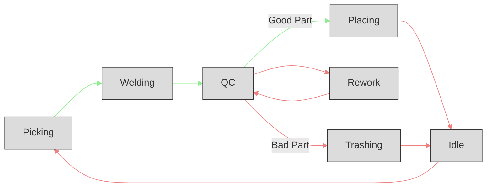
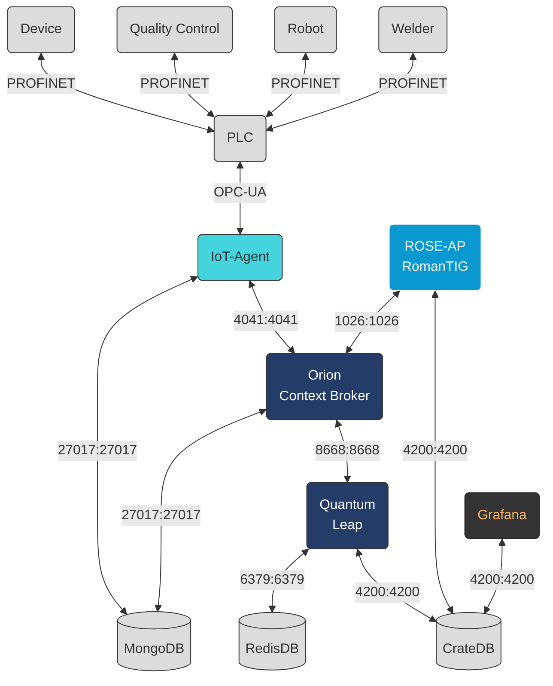

# ROMANTIG ROSE-AP [OEE](https://www.oee.com/) Calculator

[](https://fiware-ges.github.io/orion/api/v2/stable/)
[](https://github.com/FIWARE/catalogue/blob/master/core/README.md)
[](https://stackoverflow.com/questions/tagged/fiware)
<!-- [](https://opensource.org/licenses/MIT) -->

This ROSE-AP is intended as a microservice for automatic [OEE](https://www.oee.com/), and related metrics, calculation. The service works by connecting to a [CrateDB](https://crate.io/) database, where information about the context of your target process are stored by [Orion](https://fiware-orion.readthedocs.io/en/master/) through [QuantumLeap](https://quantumleap.readthedocs.io/en/latest/) services.

## Table of Contents

- [Background](#background)
- [Install](#install)
- [Usage](#usage)
- [Example](#example)
- [Architecture](#Architecture)
- [Prerequisites](#Prerequisites)
- [Troubleshooting](#troubleshooting)

## Background

[OEE](https://www.oee.com/) (Overall Equipment Effectiveness) is a metric used in industrial applications to measure the effectiveness and efficiency of a manufacturing process. It is calculated by multiplying the three factors of Availability, Performance, and Quality.

Availability refers to the percentage of time a machine is available to run, taking into account scheduled and unscheduled downtime. Performance measures the actual output of the machine versus its maximum potential output. Quality assesses the percentage of good product produced versus the total number of products produced.

Measuring [OEE](https://www.oee.com/) is important in industrial applications as it provides a comprehensive view of the efficiency of the manufacturing process. By understanding the factors that contribute to inefficiencies, organizations can identify areas for improvement, increase production, and reduce costs. Additionally, [OEE](https://www.oee.com/) is a key indicator of the overall competitiveness of a company, as it is directly tied to production output and profitability.

## Install
### Data Interface
> **Warning**
> The value of the `OCB_ID` .env variable must match with the data variable supllied.
> You can indifferently replace the value of the environment variable to match that of your variable, or call your variable as it is defined in the .env file.
#### OPC-UA
If you would use the [OPC-UA](https://opcfoundation.org/) interface, in order to connect the IoT-Agent to an [OPC-UA](https://opcfoundation.org/) device, you just need to edit the relative section (OPC-UA Device Variables) in the beginning of the [`.env`](.env) file:
- `IOTA_OPCUA_ENDPOINT` Endpoint of the [OPC-UA](https://opcfoundation.org/) Device to be reached by the IoT Agent (i.e. the PLC adress)
- `OCB_ID` The name of the Variable which has values about the machine state
- `OPCUA_ID` The [OPC-UA](https://opcfoundation.org/) ID of the Variable which hold the machine state values

You can check this value with any [OPC-UA](https://opcfoundation.org/) Client

#### Other protocols
If you whis to use any other protocol, you need to replace the IoT-Agent, and configure it to make the data available to the [Orion Context Broker](https://fiware-orion.readthedocs.io/en/latest/).

### ROSE-AP
In order to compute the [OEE](https://www.oee.com/), the ROSE-AP service must know if each possible process state that is found on the context has to be considered:
 - An up-time or a down-time state.
 - A good or a bad end of the production cycle.
 - The ideal duration of a production cycle.
 - A time step and a starting date and time to group the data.

To do so, please change the `.config` file found in the `oee_service` folder, prior to run the service, setting the following variables:

> **Warning**
> Be sure that the name of the states written in the config file perfectly match those that are written by your process, so that the microservice can correctly identify them

- Good ends
The machine states to be considered as a successful conclusion of the production cycle (i.e. an item is successfully created):

	ENDSGOOD=In Placing	[syntax: State 01,State 02, ... ,State nn]

- Bad ends
The machine states to be considered as a bad conclusion of the production cycle (i.e. an item is defective or faulty and has to be discarded):
	ENDSBAD=In Trashing	[syntax: State 01,State 02, ... ,State nn]

- Up time
The machine states to be considered as productive times:

	TIMESUP=In Picking,In Welding,In QC,In Placing	[syntax: State 01,State 02,...,State nn]
	
- Down time
The machine states to be considered as downtime:

> **Note**
> To avoid unexpected behavior (i.e., not updating statistics if the machine stops for any reason), a `Timeout` variable should be provided that fires cyclically when each new timeout is reached.

	TIMESDOWN=Idle,In Reworking,In QC from rework,In Trashing,Timeout	[syntax: State 01,State 02,...,State nn]

- Time step
The timestep to group [OEE](https://www.oee.com/) stats:
> **Note**
> Since OEE values are calculated from the data stored in the database, it is possible to increase or decrease the timestep value by updating the data grouping over the entire stored range without losing any information.

	TIMESTEP=5 minute	[syntax: <quantity> <[second|minute|hour|day|week|month|year]>]

- Ideal time
The duration of the process in ideal condition, this represents a theoretical lower bound.

	IDEALTIME=20 second	[syntax: <quantity> <[second|minute|hour|day|week|month|year]>]

- Initial date and time
The date and time to be considered as the origin of data grouping:

	START_DATE=2023-01-01	[syntax: <YYYY-MM-DD>]
	START_TIME=08:00:00	# syntax: <hh-mm-ss>

## Usage
- Follow the [installation instruction](#install)
- Star the Docker daemon.
- Make the `./services` script executable
`sudo chmod +x ./services`

- Build the Docker image for the OEE microservice (Remove the old image if any, build the new image and performs a vulnerability scan):
`./services --build`

- To apply required settings to the host, and start up all the services in the containers run:
`sudo ./services up`

- Now you can open Grafana on [localhost:3000](localhost:3000) `user:admin` `password:admin` and select predefined "RomanTIG Overall Equipment Effectiveness" dashboard to visualize [OEE](https://www.oee.com/) live data. You can freely add plots and other tables by using the "add new panel" function of Grafana, than save as a [`dashboard.json`](.\grafana\dashboards\dashboard.json) file in `.\grafana\dashboards\` directory to persist the changes after rebooting the container or the Grafana service.

- To stop all the services in the containers execute:
`./services down`
- To only pull all images from Docker Hub without start the services in the Docker Container:
`./services --pull`
- To stop, build and start the services in the Docker Container:
`sudo ./services --debug`
- To see the help function of the service script
`./services --help`

- To delete the Volumes and the Networks
> **Warning**
> This operation will ERASE ALL the Docker Volumes and all the data stored in the databases!
`./services --remove`

## Example


Our example use-case scenario is based on an automated welding robotic system which performs several tasks. At first, a stereometrics scanner individuates the 3D pose estimate of target pipes, then the robot arm proceeds to pick those and place them in front of a torch, where they will be welded. Once welded, the system proceeds to perform a quality control check to validate the welding: if the check succeeds, the pipe is placed in the final bin; if the check fail, welding is performed again and the QC control the pipe a second time. If the check fails twice in a row, the pipe is discarded. 

The process cycle and the respective up and down time states are shown below:



In general, we suggest you to adopt a state space representation similar to the one above for your target process, in order to clearly highlight every step in the cycle and attribute it the correct value for up or down time. The state representation (the ontology of the system) should not be too detailed (i.e. too many states) or too general (i.e. one or two states) because of unnecessary additional workload or possible loss of information.

As it can be seen in the docker-compose file, the PLC responsible for controlling our process is directly connected to [Orion Context Broker](https://fiware-orion.readthedocs.io/en/latest/) through the [IoT Agent for OPC-UA](https://iotagent-opcua.readthedocs.io/en/latest/) servers, which is used to write the process states directly on the CrateDB (through QuantumLeap) where they will be read and processed by our [OEE](https://www.oee.com/) calculator.

## Architecture

This application builds on the following components [ROSE-AP RomanTIG](https://github.com/claret-srl/romantig_RAMP_ROSEAP). It will use the following FIWARE components: the [Orion Context Broker](https://fiware-orion.readthedocs.io/en/latest/), the [QuantumLeap](https://smartsdk.github.io/ngsi-timeseries-api/) and the [IoT Agent for OPC-UA](https://iotagent-opcua.readthedocs.io/en/latest/).

Therefore the overall architecture will consist of the following elements:
-   The **FIWARE Generic Enablers**:
    -   The FIWARE [Orion Context Broker](https://fiware-orion.readthedocs.io/en/latest/) which will receive requests using [NGSI-v2](https://fiware.github.io/specifications/OpenAPI/ngsiv2)
    -   The FIWARE [IoT Agent for OPC-UA](https://iotagent-opcua.readthedocs.io/en/latest/) which will receive northbound measurements from the dummy IoT devices in [OPC-UA](https://iotagent-opcua.readthedocs.io/en/latest/)
        format and convert them to [NGSI-v2](https://fiware.github.io/specifications/OpenAPI/ngsiv2) requests for the context broker to alter the state of the context entities
    -   FIWARE [QuantumLeap](https://quantumleap.readthedocs.io/en/latest/) subscribed to context changes and persisting them into a **CrateDB** database
-   A [MongoDB](https://www.mongodb.com/) database:
    -   Used by the **Orion Context Broker** to hold context data information such as data entities, subscriptions and registrations
    -   Used by the **IoT Agent** to hold device information such as device URLs and Keys
-   A [CrateDB](https://crate.io/) database:
    -   Used as a data sink to hold time-based historical context data
    -   offers an HTTP endpoint to interpret time-based data queries
-   A **Context Provider**: - Should be supplied by integrator, as an active OPC-UA device. It could be replaced with any other protocol as far as the relative IoT Agent is used instead of the [OPC-UA](https://iotagent-opcua.readthedocs.io/en/latest/) one.

Since all interactions between the elements are initiated by HTTP requests, the entities can be containerized and run from exposed ports.

The overall architecture can be seen below:



## Context
The provisioned device holding the Process Status information, it get a call back of the OEE values, because of that enquiring the [Orion Context Broker](https://fiware-orion.readthedocs.io/en/latest/) about the entity, with the GET request to `v2/entities` endpoint:

```
curl -X GET \
--url 'http://localhost:1026/v2/entities' \
-H 'fiware-service: opcua_plc' \
-H 'fiware-servicepath: /demo'
```
Will result in the following output:
```
[
  {
    "id": "urn:ngsiv2:I40Asset:PLC:001",
    "type": "PLC",
    "Availability": {
      "type": "Float",
      "value": 0.646473505,
      "metadata": {}
    },
    "OEE": {
      "type": "Float",
      "value": 0.302358872,
      "metadata": {}
    },
    "Performance": {
      "type": "Float",
      "value": 0.701557458,
      "metadata": {}
    },
    "Quality": {
      "type": "Float",
      "value": 0.666666667,
      "metadata": {}
    },
    "processStatus": {
      "type": "Text",
      "value": "In Placing",
      "metadata": {}
    }
  }
]
```
The attribute it's updated each time the processStatus values change.

### HTTP Request endpoint

the service has two endpoint:
 - /version: which can be used to run health check

[docker-compose.yml](./docker-compose.yml)
```
healthcheck:
   test: curl -s -o /dev/null -w %{http_code} "http://${ROSEAP_OEE}:${ROSEAP_OEE_PORT}/version" == 200 || exit 1
   interval: 5s
```
 - /v2/update: used to point the subscription on value change, to trigger the updates of the OEE related attributes.

## Prerequisites

### Docker and Docker Compose

To keep things simple all components will be run using [Docker](https://www.docker.com). **Docker** is a container
technology which allows to different components isolated into their respective environments.

-   To install Docker on Windows follow the instructions [here](https://docs.docker.com/docker-for-windows/)
-   To install Docker on Mac follow the instructions [here](https://docs.docker.com/docker-for-mac/)
-   To install Docker on Linux follow the instructions [here](https://docs.docker.com/install/)

**Docker Compose** is a tool for defining and running multi-container Docker applications. A series of
[YAML files](https://raw.githubusercontent.com/Fiware/tutorials.Time-Series-Data/master/docker-compose.yml) are used to
configure the required services for the application. This means all container services can be brought up in a single
command. Docker Compose is installed by default as part of Docker for Windows and Docker for Mac, however Linux users
will need to follow the instructions found [here](https://docs.docker.com/compose/install/)

You can check your current **Docker** and **Docker Compose** versions using the following commands:

```console
docker-compose -v
docker version
```

Please ensure that you are using Docker version 20.10 or higher and Docker Compose 1.29 or higher and upgrade if
necessary.

## Troubleshooting

### /bin/bash^M: bad interpreter: No such file or directory

If the following error will appear creating or starting the container:
```
/bin/bash^M: bad interpreter: No such file or directory
```
Please use the utility `dos2unix` to convert the text files from DOS/Mac to Unix environment, install `dos2unix` on CentOS/Fedora/RHEL
```
sudo yum update
sudo yum install dos2unix
```
or in Ubuntu/Debian:
```
sudo apt update
sudo apt install dos2unix
```
Then run the utility `dos2unix_Recursively.sh`, in the root directory, to convert all the text files from DOS/Mac to Unix environment, with the following command>
```
./utility/dos2unix_Recursively.sh
```

### [Orion Context Broker](https://fiware-orion.readthedocs.io/en/latest/), [QuantumLeap](https://smartsdk.github.io/ngsi-timeseries-api/), [IoT Agent for OPC-UA](https://iotagent-opcua.readthedocs.io/en/latest/)
To debug entity, device, registration, subscription, and any other Context data, please use [Mongo Express](#Mongo), as described in the [Mongo](#Mongo) section.

### Mongo
To debug the MongoDB container, check Orion, the `docker-compose` has an entry for Mongo Express, please remove the comments to enable the service.
The GUI is accessible from the service exposed at the `port: 8081`.


### CrateDB

If the CrateDB container crashes after startup, run the following command:
```
sudo sysctl vm.max_map_count=262144
```
This setting in included in the script case `sudo ./services up`.

To debug the CrateDB container, is embedded a web GUI accessible from the exposed admin `port: 4200`.

### Redis

If the Redis container crashes after startup, run the following command:
```
sudo sysctl vm.overcommit_memory=1
```
This setting in included in the script case `sudo ./services up`.

To debug the Redis container, the `docker-compose` has an entry for Redis Insight, please remove the comments to enable the service. The GUI is accessible from the service exposed port `8001`.
To add the database, insert `host: db-redis` `port: 6379` and any name you prefer.
